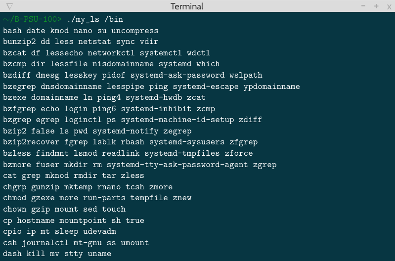

# MY_LS
## Table of Contents
1. [General Info](#general-info)
2. [Technologies](#technologies)
3. [Installation](#installation)
4. [Overview](#Overview)
### General Info
***
This is project aims to recreate the "ls" shell command. This project lasted 2 weeks from 04/11/2022 to 17/11/2022.

## Technologies
***
A list of technologies used within the project:
* [LIBC](https://www.ibm.com/docs/en/i/7.5?topic=extensions-standard-c-library-functions-table-by-name): latest available
## Installation
***
```
$ git clone git@github.com:matheo2027/My_ls.git
$ cd My_ls
$ make
$ ./my_ls
```
## Overview
***

